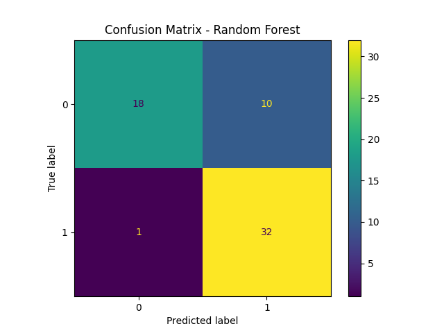
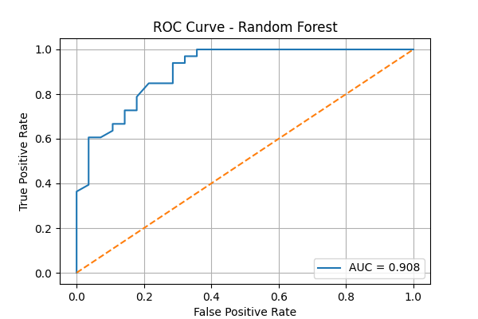

# ❤️ Heart Disease Prediction using Machine Learning

## 📌 Objective
Predict whether a patient has heart disease based on medical attributes using ML classification models.

## 📂 Dataset
Heart Disease UCI Dataset  
Source: https://raw.githubusercontent.com/sharmaroshan/Heart-UCI-Dataset/master/heart.csv

## ⚙️ Models Used
- Logistic Regression
- SVM
- Random Forest (Best Model)
- XGBoost

## 🏆 Best Model
Random Forest (~82% accuracy)

## 📊 Output
0 = No Disease  
1 = Disease

## 🚀 How to Run
Open the notebook in Google Colab and run all cells.

## 📌 Results

### ✅ Confusion Matrix

### ✅ ROC Curve

### ✅ Model Accuracy Table
The accuracy comparison is saved in: `results/model_accuracy.csv`